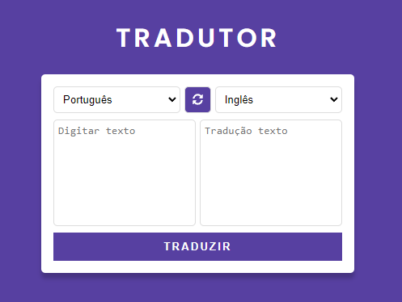
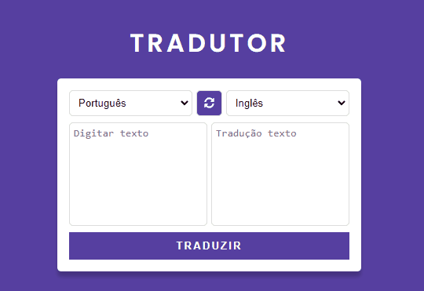

# API Tradutor 

Este projeto, como o próprio nome diz, é um tradutor de idiomas. Foi inserido apenas 4 idiomas, além do Português.
Também foi inserido um botão bem funcional, de alternar os idiomas

## Tecnologias utilizadas
- HTML
- CSS
- Javascript

### Consumindo API
Neste projeto, foi necessário consumir a API [My Memory API](https://mymemory.translated.net/doc/spec.php) para de fato, realizar a tradução. Dentro do endpoint, foi selecionado o valor da tag `textarea`, onde está o texto que precisa ser traduzido. No final do endpoint, também foi selecionado os idiomas de dentro dos `selects`, para realizar a tradução no idioma desejado.

### Demonstração do projeto
